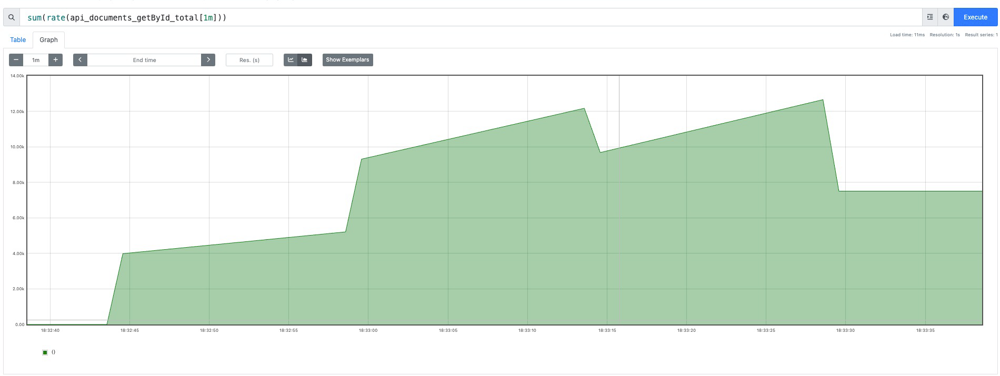
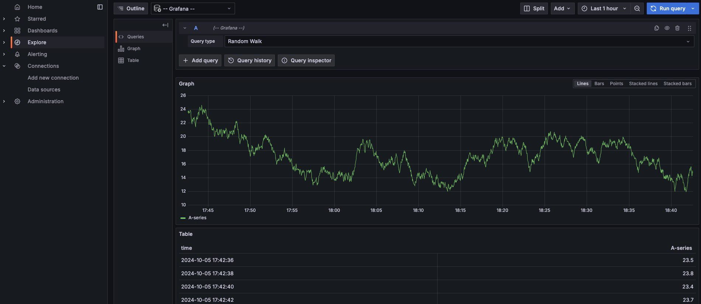

# Monitoring

## Metrics
In Spring Boot 2.0, the in-house metrics were replaced with Micrometer. Example usage of Micrometer, Prometheus, and Grafana to monitor the application metrics. More examples can be found in the [Micrometer Registry Prometheus](https://micrometer.io/docs/registry/prometheus) documentation. Example of creating alerts can be found in this documentation: [Prometheus Alerting](https://prometheus.io/docs/alerting/latest/alertmanager/) and blog post [Prometheus Alerting](https://medium.com/@ravipatel.it/building-a-monitoring-stack-with-prometheus-grafana-and-alerting-a-docker-compose-ef78127e4a19).

### Dependencies
- `micrometer-registry-prometheus` (expose API for metrics)
- `spring-boot-starter-actuator` (expose metrics end-points)

### Configuration
**application.properties**
```properties
spring.application.name - simply, the name of our application
management.metrics.tags.application - we may monitor multiple applications on our Grafana dashboard, so we need to distinguish one application from another
management.endpoints.web.exposure.include=prometheus - to enable /actuator/prometheus endpoint
```

### Custom Health Groups
```properties
management.endpoint.health.group.custom.include=diskSpace,ping
management.endpoint.health.group.custom.show-components=always
management.endpoint.health.group.custom.show-details=always
# Show only to authorized users
management.endpoint.health.group.custom.show-components=when_authorized
management.endpoint.health.group.custom.show-details=when_authorized
```

### Example Metrics to Monitor
- `service_documents_getById` - timer showing how long it takes to get a document by id
- `api_documents_getById` - counter showing how many times the endpoint was called `GET /api/documents/{id}`

**Counter for `api_documents_getById`**
```promql
rate(api_documents_getById_seconds_count[1m])
```

**HTTP Graphs**
- Avg response time for statuses other than 5..:
  ```promql
  sum(rate(http_server_requests_seconds_sum{status!~"5.."}[60s])) / sum(rate(http_server_requests_seconds_count{status!~"5.."}[60s])), label avg
  ```
- The longest response time for statuses other than 5..:
  ```promql
  max(http_server_requests_seconds_max{status!~"5.."}), label max
  ```

## Docker
Example usage of Docker to containerize the application. More examples can be found in the [Docker](https://docs.docker.com/get-started/) documentation. List of docker compose examples can be found in the [Awesome Compose](https://github.com/docker/awesome-compose) documentation.

Running applications with user privileges helps to mitigate some risks (see, for example, a thread on StackExchange). So, an important improvement to the Dockerfile is to run the application as a non-root user.

### Directory: `./docker`
Update `scrape_configs[].static_configs[].targets` list under microservices job in `./docker/prometheus/prometheus.yml` with your IP address. On **macOS**, you can use `ifconfig | grep "inet " | grep -v 127.0.0.1` command.

### Deploy with Docker Compose
After that in `./docker` directory run:
```sh
docker-compose up -d --remove-orphans
```
to start Prometheus and Grafana running in Docker.

### Stop (and remove) Containers
Stop and remove the containers. Use `-v` to remove the volumes if looking to erase all data.
```sh
docker compose down -v
```

### Expected Result
Listing containers must show two containers running and the port mapping as below:
```sh
$ docker ps
CONTAINER ID        IMAGE               COMMAND                  CREATED             STATUS              PORTS                    NAMES
dbdec637814f        prom/prometheus     "/bin/prometheus --c…"   8 minutes ago       Up 8 minutes        0.0.0.0:9090->9090/tcp   prometheus
79f667cb7dc2        grafana/grafana     "/run.sh"                8 minutes ago       Up 8 minutes        0.0.0.0:3000->3000/tcp   grafana
```

### Access Metrics
Verify that Prometheus is scraping metrics from your Spring Boot application by visiting [http://localhost:9090/targets](http://localhost:9090/targets).

| Service     | IP Address | Port |
|-------------|------------|------|
| Prometheus  | localhost  | 9090 |
| Grafana     | localhost  | 3000 |

## Dashboards
You can browse available dashboards under this address: [Grafana Dashboards](https://grafana.com/grafana/dashboards). JVM (Micrometer) dashboards: [JVM Micrometer](https://grafana.com/grafana/dashboards/4701-jvm-micrometer/).

## Service Traffic Simulation using Hey Tool
Hey is a tiny program that sends some load to a web application. It's like Apache Bench (ab), but modern and more sophisticated. [Hey GitHub](https://github.com/rakyll/hey)
```sh
hey -c 10 -n 50 "http://localhost:8080/api/documents/1"
hey -c 10 -n 20 "http://localhost:8080/api/documents/2"
```



