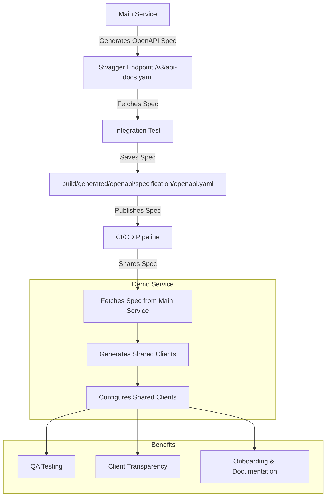

## OpenAPI Documentation for Microservices

### Contents
1. [Summary](#summary)
2. [Main Service](#main-service)
    - [Overview](#overview)
    - [Limitations](#limitations)
    - [Integration Test](#integration-test)
    - [Spring Security Configuration](#spring-security-configuration)
3. [Demo Service](#demo-service)
    - [Overview](#overview-1)
    - [Gradle Logic](#gradle-logic)
    - [Configuration for Shared Clients](#configuration-for-shared-clients)
4. [Benefits](#benefits)

### Summary
This documentation provides an overview of how to generate and use OpenAPI specifications across multiple microservices. It includes details on how the main service generates the OpenAPI specifications from the existing controller and models, the demo service that consumes these specifications, and the Gradle logic used to automate the generation of client code.

In real scenarios, the OpenAPI specifications will be shared across multiple microservices to ensure consistency and compatibility between services. This creates a contract between the services, reducing the risk of breaking changes and providing a clear understanding of the API endpoints and data models.


### Main Service

#### Overview
The Main Service exemplifies the generation of OpenAPI `.yaml` specifications via Swagger for documented controllers, models, etc. The specification can be fetched from the Swagger endpoint `/v3/api-docs.yaml`.

#### Limitations
- The Spring Boot application must be running to fetch the specification via the Swagger endpoint.

An integration test with limited scope can run as part of the CI/CD pipeline to fetch / create the OpenAPI specification.

```java
@SpringBootTest(webEnvironment = SpringBootTest.WebEnvironment.RANDOM_PORT)
public class OpenApiSpecificationIT {

  private static final Logger logger = LoggerFactory.getLogger(OpenApiSpecificationIT.class);
  private static final String OPENAPI_SPEC_OUTPUT= "build/generated/openapi/specification/";
  private static final String OPENAPI_SPEC_FILE_NAME = "openapi.yaml";

  @LocalServerPort
  private int port;

  @Autowired
  private TestRestTemplate restTemplate;

  @Test
  public void generateOpenApiSpec() throws IOException {
    String url = "http://localhost:" + port + "/v3/api-docs.yaml";
    ResponseEntity<String> response = restTemplate.getForEntity(url, String.class);

    if (response.getStatusCode().is2xxSuccessful() && response.getBody() != null) {
      saveToFile(OPENAPI_SPEC_OUTPUT + OPENAPI_SPEC_FILE_NAME, response.getBody());
    } else {
      logger.error("Failed to generate OpenAPI specification through swagger /v3/api-docs.yaml: {}", response.getStatusCode());
      throw new RuntimeException("Failed to fetch OpenAPI specification");
    }
  }

  private void saveToFile(String filePath, String content) throws IOException {
    File file = new File(filePath);
    Files.createDirectories(Paths.get(file.getParent()));
    try (FileWriter writer = new FileWriter(file)) {
      writer.write(content);
    }
    logger.info("OpenAPI specification saved to {}", filePath);
  }
}
```

#### Spring Security Configuration
A simple example of Spring Security configuration is created to whitelist Swagger endpoints. Authentication rules can also be created.

### Demo Service

#### Overview
The Demo Service can fetch or use a copy of the Main Service specification. The specifications are placed in the `root_dir/specs/` directory and declared in the `build.gradle` file.

#### Gradle Logic
The Gradle logic takes each specification and generates shared clients from the Main Service and others.

```groovy
// We could provide just the directory, fetch the .yaml files and iterate over them
String[] specifications = [
    "main_service_v1",
    "user_service_v2"
]

void createOpenApiGenerateTask(String yamlSpec) {
  String taskName = "openApiGenerate_" + yamlSpec;
  task(taskName, type: org.openapitools.generator.gradle.plugin.tasks.GenerateTask) {
    inputSpec.set("$rootDir/specs/${yamlSpec}.yaml".toString())
    outputDir.set("$buildDir/generated/openapi/${yamlSpec}")
    ignoreFileOverride.set("$rootDir/.openapi-generator-ignore")
    invokerPackage.set("com.org.${yamlSpec}") // Could extract as constant
    packageName.set("com.org.${yamlSpec}")
    modelPackage.set("com.org.${yamlSpec}.model")
    apiPackage.set("com.org.${yamlSpec}.api")
    modelNameSuffix.set('')
    validateSpec.set(true)

    // spring, java, etc -> This is what we actually generate from the provided spec. No reason not to use the same language as the project
    generatorName.set('java') // spring, java, etc
    // TODO: use yaml configuration file to set configOptions
    configOptions.set([
        dateLibrary: "java8",
        generateBuilders: "true",
        generateClientAsBean: "true",
        library: "restclient", // spring-boot, restclient,
        useRuntimeException: "true",
        userBeanValidation: "true",
    ])
  }
  tasks.deleteExtraGeneratedDirectories {
    dependsOn(taskName)
  }
}

for (String yamlSpec : specifications) {
  createOpenApiGenerateTask(yamlSpec);
}

// Making generated source visible (classpath)
sourceSets {
  main {
    java {
      srcDir("${buildDir}/generated/openapi/main_service_v1/src/main/java")
      srcDir("${buildDir}/generated/openapi/user_service_v2/src/main/java")
      srcDir("${buildDir}/generated/openapi/src/main/java")
    }
  }
}

tasks.compileJava {
  dependsOn(tasks.deleteExtraGeneratedDirectories)
}
```

#### Configuring Shared Clients From External Services
Each shared client is configured within the demo application to be used as part of the main codebase.

```java
@Configuration
public class MainServiceClientConfig {
  private final String baseUrl;

  public MainServiceClientConfig(@Value("${microservices.main.baseUrl}") final String baseUrl) {
    this.baseUrl = baseUrl;
  }

  @Bean
  public ApiClient apiClient(RestClient.Builder builder) {
    var restClient = builder
        .requestInterceptor(new BasicAuthenticationInterceptor("admin", "admin"))
        .build();
    var apiClient = new ApiClient(restClient);
    apiClient.setBasePath(baseUrl);
    return apiClient;
  }

  @Bean
  public DocumentsApi documentsApi(ApiClient apiClient) {
    return new DocumentsApi(apiClient);
  }
}
```

### Benefits
- **Quality Assurance**: The OpenAPI specifications can be shared with QA teams for testing.
- **Client Transparency**: The specifications can be shared with clients for better transparency and clarity.
