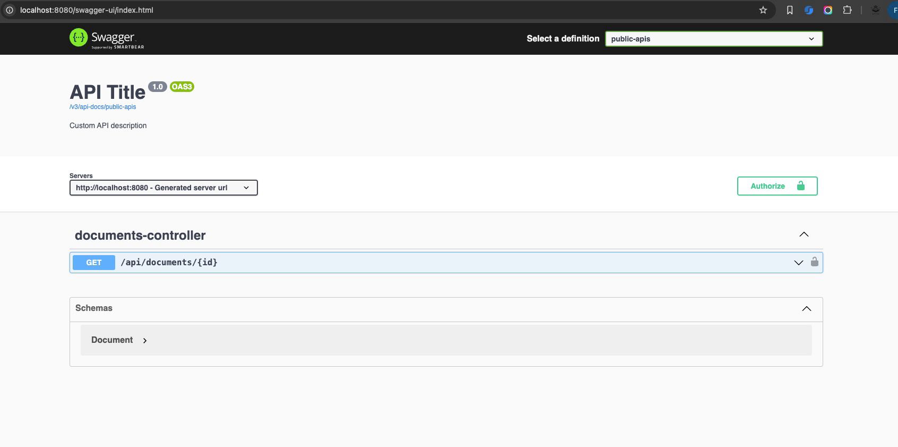
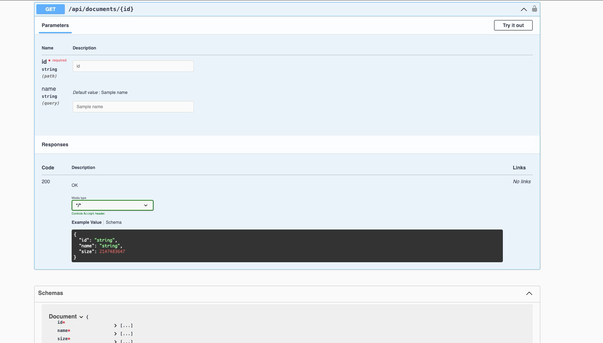

# Swagger Documentation for Spring Boot Microservice

## Overview

This document provides an overview of how to set up and use Swagger for API documentation in your Spring Boot microservice project.

## Prerequisites

Ensure you have the following dependencies in your `build.gradle` file:

```groovy
dependencies {
    implementation 'org.springdoc:springdoc-openapi-starter-webmvc-ui:2.0.2'
}
```

## Configuration

### Security Configuration

To allow access to the Swagger UI and API documentation endpoints, update your `SecurityConfig` class as follows:

```java
package com.org.microservice.config;

import org.springframework.context.annotation.Bean;
import org.springframework.context.annotation.Configuration;
import org.springframework.security.config.annotation.web.builders.HttpSecurity;
import org.springframework.security.config.annotation.web.configuration.EnableWebSecurity;
import org.springframework.security.web.SecurityFilterChain;

@Configuration
@EnableWebSecurity
public class SecurityConfig {

  private static final String[] SWAGGER_WHITELIST = {
      "/swagger-ui/**",
      "/v3/api-docs/**",
      "/swagger-resources",
      "/swagger-resources/**",
  };

  @Bean
  public SecurityFilterChain securityFilterChain(HttpSecurity http) throws Exception {
    http
        .authorizeHttpRequests((requests) -> requests
            .requestMatchers(SWAGGER_WHITELIST).permitAll()
            .requestMatchers("/api/**").permitAll()
            .anyRequest().authenticated()
        );
    return http.build();
  }
}
```

### Application Configuration

Ensure your `application.yaml` file includes the necessary configurations:

```yaml
springdoc:
  api-docs:
    path: /v3/api-docs
  swagger-ui:
    path: /swagger-ui.html
```

## Accessing Swagger UI

After starting your application, you can access the Swagger UI at:

```
http://localhost:8080/swagger-ui/index.html
```



## Example Controller with Swagger Annotations

Here is an example of how to use Swagger annotations in your controller:

```java
package com.org.microservice.documents.controller;

import model.documents.com.org.microservice.Document;
import service.documents.com.org.microservice.DocumentsService;
import io.micrometer.core.instrument.Counter;
import io.micrometer.core.instrument.MeterRegistry;
import io.swagger.v3.oas.annotations.Operation;
import io.swagger.v3.oas.annotations.Parameter;
import jakarta.validation.constraints.NotNull;
import lombok.RequiredArgsConstructor;
import org.springframework.http.ResponseEntity;
import org.springframework.web.bind.annotation.GetMapping;
import org.springframework.web.bind.annotation.PathVariable;
import org.springframework.web.bind.annotation.RequestMapping;
import org.springframework.web.bind.annotation.RequestParam;
import org.springframework.web.bind.annotation.RestController;

@RestController
@RequiredArgsConstructor
@RequestMapping("/api/documents")
public class DocumentsController {

  private final MeterRegistry meterRegistry;
  private final DocumentsService documentsService;

  @GetMapping("/{id}")
  @Operation(summary = "Get a document by its id")
  public ResponseEntity<Document> getDocumentById(
      @Parameter(description = "id of document to be fetched") @PathVariable @NotNull final String id,
      @RequestParam(required=false, defaultValue="Sample name")  final String name ) {

    Counter counter = Counter.builder("api_documents_getById")
        .tag("id", id)
        .description("The number of times the /api/documents/{id} end-point is called")
        .register(meterRegistry);
    counter.increment();

    final var document = documentsService.getDocumentsById(id);
    return ResponseEntity.ok(document);
  }
}
```

## Docker Configuration

Ensure your `docker-compose.yml` file exposes the necessary ports:

```yaml
services:
  spring-boot-microservice:
    container_name: spring_boot_microservice
    build:
      context: ..
      dockerfile: Dockerfile
    ports:
      - "8080:8080" # Application port
      - "8081:8081" # Management port
    restart: always
```


## Export the OpenAPI spec to a YAML file
Can use tools like curl to fetch the OpenAPI spec and save it as a YAML file.  
curl -o openapi.yaml http://localhost:8080/v3/api-docs.yaml
This will generate the OpenAPI specification YAML file from your existing Spring Boot controller.